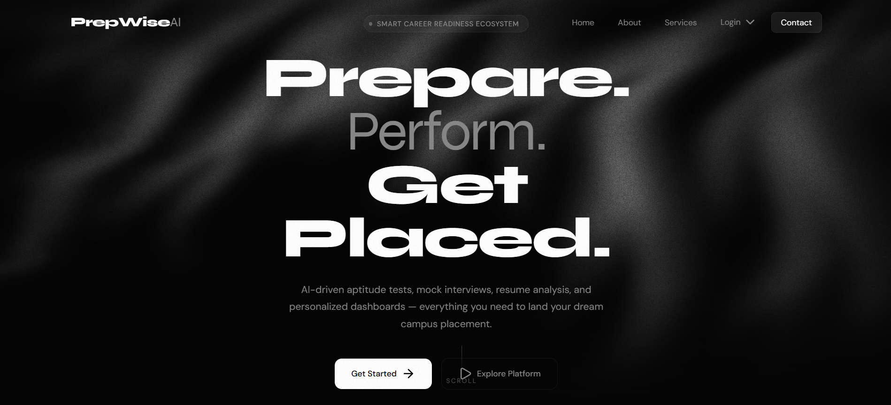
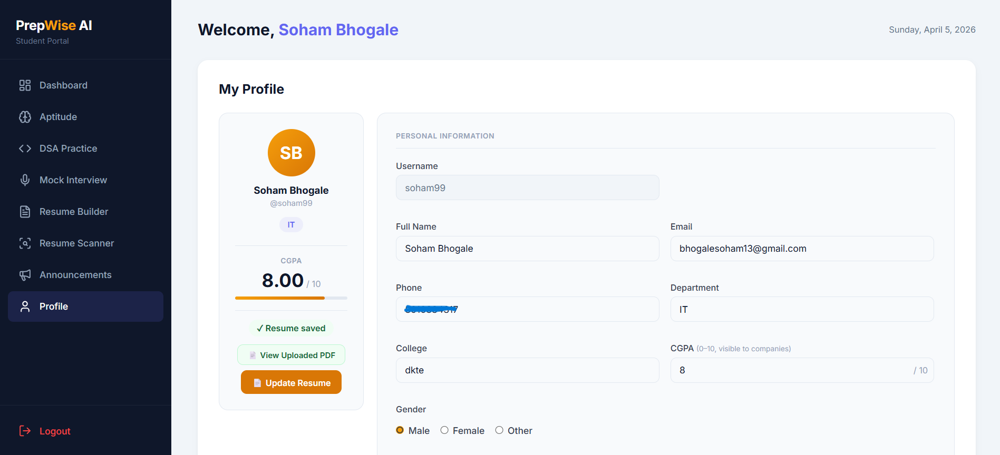
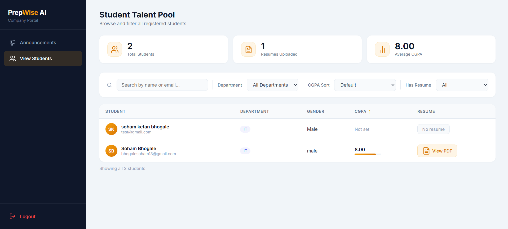

# PrepWise AI

AI-powered placement preparation platform with mock interviews, aptitude tests, DSA practice, resume builder & ATS scanner.

---

## Screenshots

### Landing Page


### Student Profile


### Admin Dashboard


### Company — Student Talent Pool


---

## Features

- **Mock Interviews** — AI-generated technical questions with real-time proctoring (face detection)
- **Aptitude Tests** — General & technical quizzes with timed sessions and performance tracking
- **DSA Practice** — Coding problems with in-browser code execution and submission history
- **Resume Builder** — Two-template resume builder with PDF export and profile saving
- **ATS Scanner** — AI-powered resume analysis against job descriptions
- **Multi-role System** — Separate dashboards for Students, Admins, and Companies
- **Company Portal** — Browse students, filter by CGPA/department, view resumes

---

## Tech Stack

| Layer | Technology |
|---|---|
| Frontend | HTML, CSS, JavaScript (vanilla) |
| Backend | Node.js, Express |
| AI API | Python, FastAPI, Google Gemini |
| Database | MongoDB Atlas |
| Auth | Google OAuth 2.0 |
| File Storage | Multer (PDF uploads) |

---

## Project Structure

```
prepwiseAI/
├── public/          # All frontend HTML pages
├── api/             # Python FastAPI (AI features)
│   ├── routes/      # aptitude, dsa, interview, resume, proctor
│   └── services/    # Gemini AI, code executor
├── data/            # Question datasets (xlsx, csv)
├── scripts/         # Utility scripts
├── uploads/         # User-uploaded resumes (gitignored)
├── server.js        # Node.js/Express server
└── requirements.txt
```

---

## Setup

### Prerequisites
- Node.js 18+
- Python 3.10+
- MongoDB Atlas account
- Google Cloud project (OAuth + Gemini API)

### 1. Clone & install

```bash
git clone https://github.com/anonSoham/prepwiseAI.git
cd prepwiseAI
npm install
pip install -r requirements.txt
```

### 2. Configure environment

Create a `.env` file in the root:

```env
GOOGLE_CLIENT_ID=your_google_oauth_client_id
MONGO_URI=your_mongodb_connection_string
GEMINI_API_KEY=your_gemini_api_key
GEMINI_MODEL=gemini-2.5-flash
```

### 3. Run

```bash
npm start
```

This starts both the Node.js server (port 3000) and the Python FastAPI server (port 8000).

Open [http://localhost:3000](http://localhost:3000)

---

## Roles & Access

| Role | Login | Default Credentials |
|---|---|---|
| Student | Google OAuth | — |
| Admin | `/admin-login.html` | Set via MongoDB |
| Company | `/company-login.html` | Set via seed script |

Seed the company account:
```bash
npm run seed
```
